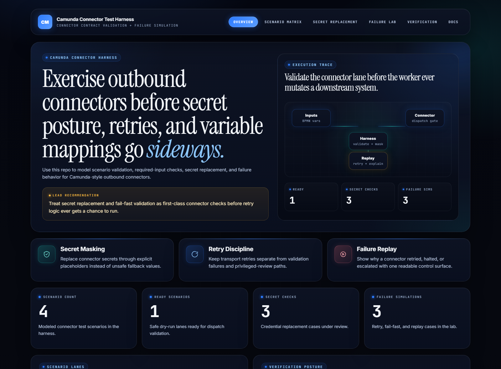
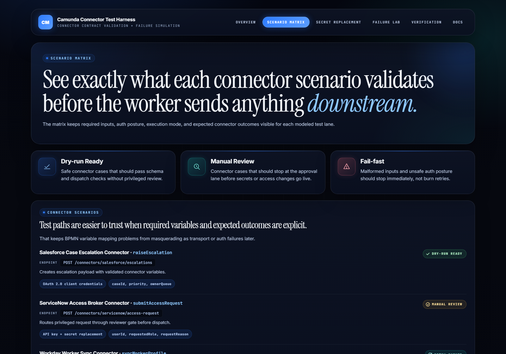
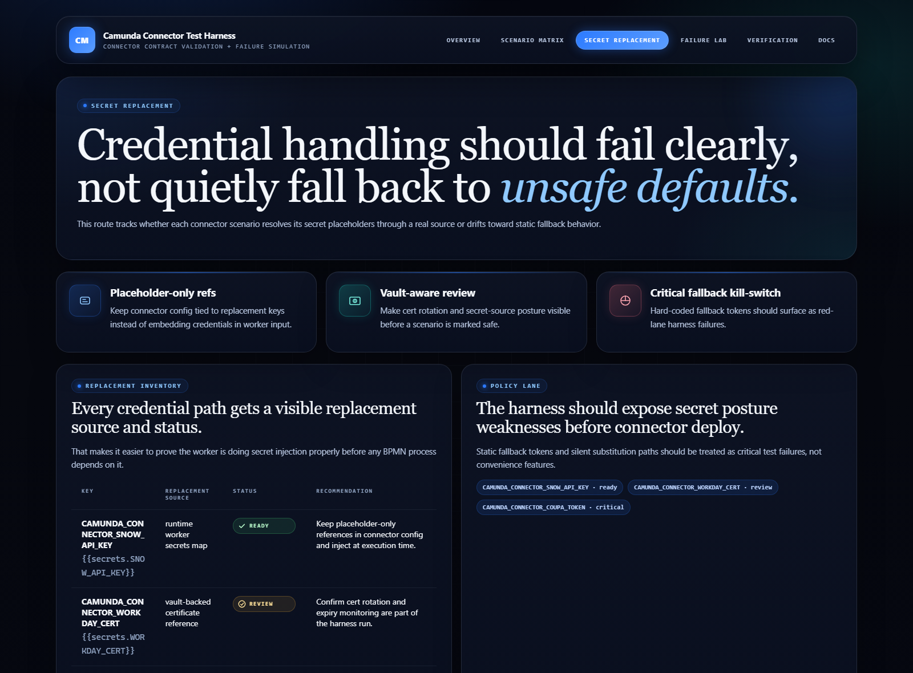
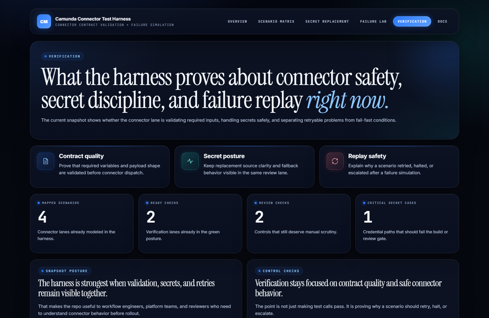

# Camunda Connector Test Harness

> Contract-test outbound Camunda connectors before BPMN variables, secret posture, and retry logic drift into fragile automation.

TypeScript harness for exercising Camunda-style outbound connectors against required-input validation, secret replacement, retry behavior, and failure replay — surfaced through one operator-readable HTML control surface plus a parallel JSON API.

## Why this exists

Outbound connector demos usually prove one happy path and stop there. Real connector work fails on weak variable mapping, missing required inputs, hard-coded secret fallbacks, and retry logic that can't explain why it replayed or stopped. This repo treats those concerns as **first-class connector checks** that run before any worker mutates a downstream system.

## What you see

A dark, operator-grade dashboard for every connector scenario the harness models — endpoint, auth model, required inputs, execution mode, expected outcome, and current verification status. Status lanes are explicit: **Dry-run Ready · Manual Review · Retry Queued · Fail-fast**.



The overview pairs the hero recommendation with an execution-trace diagram (Inputs → Harness → Connector → Replay), four headline metrics (scenarios, ready lanes, secret checks, failure sims), and the cross-cutting verification posture for the lane.



The scenario matrix shows each modeled connector with the canonical endpoint as a monospaced code block, the auth model and required-input signal chips, and a status pill that explains where the lane sits today.



The secret replacement page makes credential handling explicit. Every connector key gets a visible replacement source, a status pill, and a recommendation. Hard-coded fallbacks register as critical failures, not convenience features.



The verification page is the read-out: mapped scenarios, ready checks, review checks, and critical secret cases — alongside the controls that still deserve manual scrutiny.

## What it proves

- **TypeScript + Node** coverage in the workflow-automation lane
- **Camunda-flavored connector scenarios** with explicit required-input and auth posture visibility (Salesforce escalation · ServiceNow access broker · Workday worker sync · Coupa vendor hold)
- **Secret replacement checks** that surface unsafe fallback behavior
- **Failure lab** for retry, fail-fast, and replay-safe operator actions
- **Same payloads via JSON** so tests + automation read the same shape the dashboard renders

## Routes

### HTML surfaces

- `/` — Overview + execution trace + headline metrics
- `/scenario-matrix` — Connector scenarios with endpoint, auth, required inputs, status
- `/secret-replacement` — Credential replacement inventory + policy lane
- `/failure-lab` — Retry / manual escalation / fail-fast simulation matrix
- `/verification` — Contract quality, secret posture, replay safety snapshot
- `/docs` — Route + payload map

### JSON APIs

```
GET /api/dashboard/summary       — scenario count, ready lanes, secret checks, failure sims
GET /api/scenarios               — full connector scenario list
GET /api/secret-replacement      — credential replacement cases + status
GET /api/failure-simulations     — failure trigger / retry / operator-action rows
GET /api/verification-checks     — verification control checks
GET /api/sample                  — full snapshot of all four lanes
GET /api/health                  — `{ status: "ok", service: "camunda-connector-test-harness" }`
```

## Run locally

```powershell
cd camunda-connector-test-harness
npm install
npm run dev
```

Open <http://127.0.0.1:5124/>.

## Validate

```powershell
npm run build           # tsc strict typecheck
npm run test            # vitest route + payload tests
npm run demo            # scripted scenario walk-through
npm run smoke           # health + render check against the running server
npm run render:assets   # re-capture all four README screenshots via headless Edge
```

## Design

- Server-rendered HTML in [`src/services/render.ts`](src/services/render.ts) — zero client-side runtime, inline SVG icons, Instrument Serif + Inter + JetBrains Mono typography stack
- Data lives in [`src/data/sampleData.ts`](src/data/sampleData.ts); business logic in [`src/services/harnessService.ts`](src/services/harnessService.ts)
- Status taxonomy in [`src/types.ts`](src/types.ts): `ready · review · watch · critical` + `dry-run ready · manual review · retry queued · fail-fast`
- Screenshots are real browser captures, not mock-ups: [`scripts/render_readme_assets.ps1`](scripts/render_readme_assets.ps1) spins up the dev server, walks the routes with headless Edge at 1600px-wide viewports, and writes the four README proofs

## Docs

- [Architecture](./docs/architecture.md)
- [Origin](./docs/ORIGIN.md)
- [Changelog](./CHANGELOG.md)

## License

ISC.
